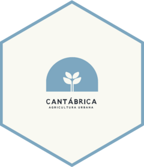

<!-- README.md is generated from README.Rmd. Please edit that file -->

# cantabricar 

<!-- badges: start -->

[](https://lifecycle.r-lib.org/articles/stages.html#experimental)
[](https://github.com/cantabrica-vertical/cantabricar/actions)
[](https://circleci.com/gh/cantabrica-vertical/cantabricar)
[](https://codecov.io/gh/cantabrica-vertical/cantabricar?branch=main)
<!-- badges: end -->

## Installación

-   Descargar [R](https://ftp.cixug.es/CRAN/) (en caso de que no esté
    descargado ya)
-   Abrir R y ejecutar los siguientes comandos en la consola:

``` r
if !("devtools" %in% installed.packages()) install.packages("devtools")
if !("keyring" %in% installed.packages()) install.packages("keyring")
keyring::key_set_with_value("cantabrica", "cantabrica-admin", "XXXXXXXX") # sustituir XXXXXX con la contraseña de Azure
devtools::install_github("cantabricagr/cantabricar") # versión principal
```

En caso de querer descargar la versión de prueba, sustituir el último
comando por:

``` r
devtools::install_github("cantabricagr/cantabricar", ref = "test") # versión principal
```

En caso de querer descargar la versión de prueba, sustituir el último
comando por:

``` r
devtools::install_github("cantabricagr/cantabricar", ref = "test") # versión principal
```

-   Ejecutar la app con el siguiente comando en la consola de R:

``` r
library(cantabricar)
launch_app()
```

Se abrirá el navegador por defecto y la app se ejecutará.

## Code of Conduct

Please note that the cantabricar project is released with a [Contributor
Code of
Conduct](https://contributor-covenant.org/version/2/0/CODE_OF_CONDUCT.html).
By contributing to this project, you agree to abide by its terms.
